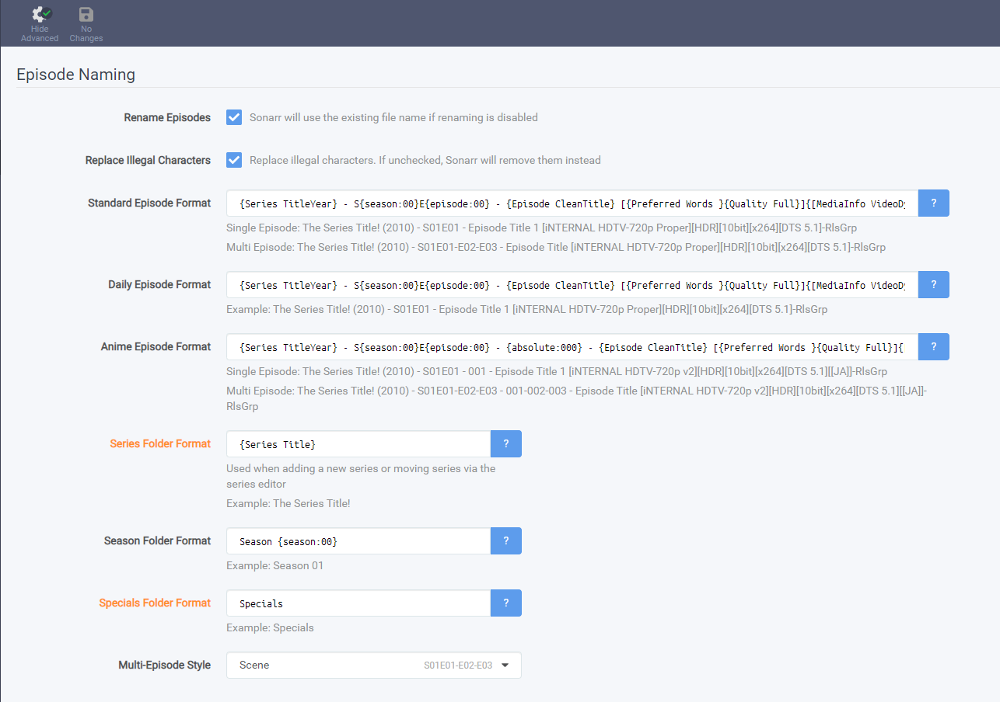
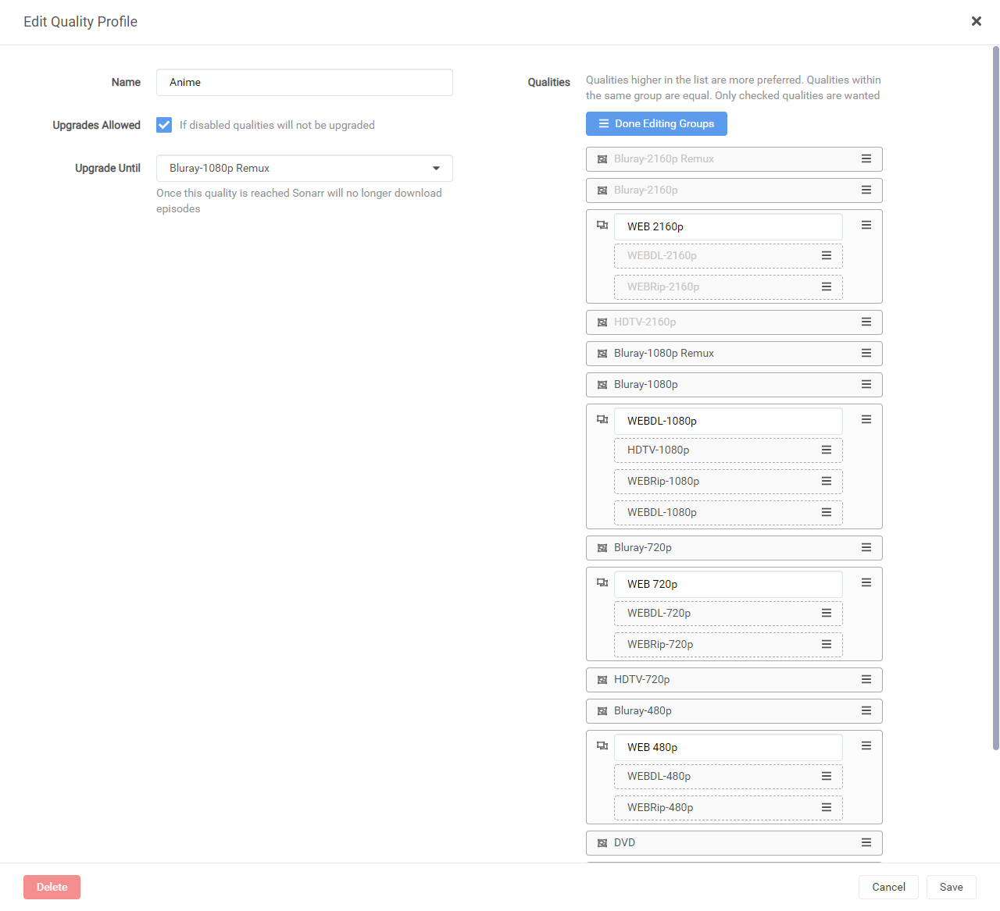
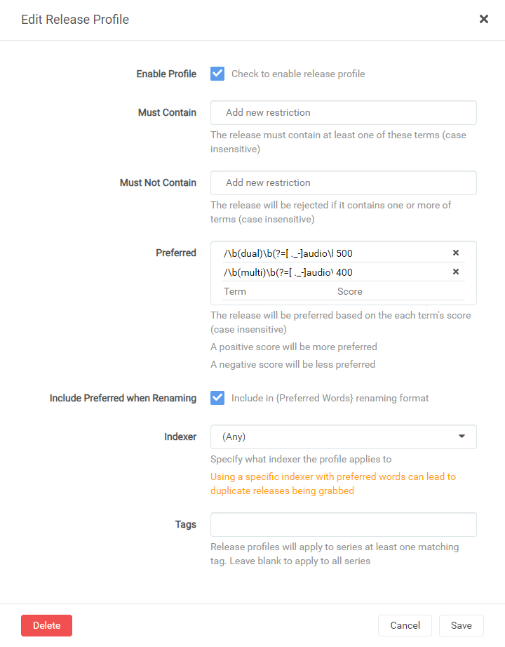

# Anime Regex for Sonarr.

## Dual-Audio Regex
Having tested most of these settings, they work pretty well but Anime is a fickle beast to toy with so be warned. 

---

## Media Management
There a few settings which make life a lot easier when tracking down and keeping certain information for your Anime. A lot of this is from [TRaSH](https://trash-guides.info/) with tweaks to make it work better with HamaAgent for plex.
| Name | Input | Notes |
| :-- | :-- | :-- |
| Anime Episode Format | `{Series TitleYear} - S{season:00}E{episode:00} - {absolute:000} - {Episode CleanTitle} [{Preferred Words }{Quality Full}]{[MediaInfo VideoDynamicRange]}[{MediaInfo VideoBitDepth}bit]{[MediaInfo VideoCodec]}{[Mediainfo AudioCodec}{ Mediainfo AudioChannels]}{[MediaInfo AudioLanguages]}{-Release Group}` | Has all necessary information and a little extra if you needed to rebuild. |
| Series Folder Format | `{Series TitleTheYear} [tvdb-{TvdbId}]` | ~~We do not want year here as it messes with the HamaAgent and how it identifies the anime. [Reference](https://forums.plex.tv/t/rel-http-anidb-metadata-agent-hama/40470/2043?u=visoseph)~~ I'm a dummy. Adding year back in with tvdb id allows matching to be correct. Thanks salty.  |
| Season Folder Format | `Season {season:00}` | Standard format that best covers most uses. |
| Multi-Episode Style | `Scene     S01E01-E02-E03` | 

### Example image of above


---

## Quality Profile
We need to set HDTV-1080p | HDTV-720p above WEB release as some groups have releases with incorrectly tagged media which causes issues when it thinks it is the best release.



---

### First Release Profile
| Term | Score | Notes |
| :-- | :-- | :-- |
| `/(uncensored)/i`                                                         | 1000 or -1000 | This is for if you want the uncensored version of anime. If you would like it to be priority then set to 1000. If you do not want uncensored set it to -1000.
| `\b(dual)(.?audio\b)\|EN\+JA\|JA\+EN/i`                                    | 500 | Dual-Audio profile. This and multi-audio are basically one and the same. But we still want dual-audio above multi. The EN+JA and JA+EN will only work if you follow my naming scheme above.|
| `/\b(multi)([ ._-]audio\b)/i`                                             | 400 | Multi-Audio profile |

### Include Preferred when Renaming
We set this so when renames or new media is added it's easily identifiable as dual/multi audio.


---

### Second Release Profile
| Term | Score | Notes |
| :-- | :-- | :-- |
| `(/ANThELIa\|\bZR\b\|kametsu\|\bctr\b\|\bscy\b\|deanzel\|\bshir\b)/i`            | 440 | Dual-Audio |
| `/(\bMK\b\|lostyears\|exiled-destiny\|E-D\|BluDragon\|Kawairemux)/i`           | 440 | Dual-Audio |
| `/(\[DragsterPS\])/i`                                                     | 425 | Multi-Audio - Multi-Subs (Usually from Netflix or similar) |
| `/(iahd\|anihls\|mkvultra\|\bdhd\b\|teneighty\|redblade\|haiku\|\bdhd\b\|walmart)/i` | 420 | Generic Dual-Audio
| `/(\[Koten_Gars\])/i`                                                     | 380 | Dual-Audio \| Mostly older content but has some newer stuff. Really good quality and searches different sources.
| `/(\[Hark0n\])/i`                                                         | 360 | Dual-Audio \| Mostly older and limited, but what he does have is amazing quality.
| `/(\[GHOST\]\|\[xPearse\]\|\[Moodkiller\])/i`                             | 340 | Dual-Audio \| xPearse has some raws. |
| `/(\[NPC\]\|\[A-L\])/i`                                                   | 320 | Dual-Audio \| NPC is mostly older. |
| `/(\[Cleo\])/i`                                                           | 300 | Dual-Audio |
| `/(\[Erai-raws\])/i`                                                      | 280 | Subs with multi such as German, French , Spanish, Italian, Russian, Arabic, Portuguese and English |
| `/(\[Anime Time\]\|\[Mysteria\])/i`                                       | 260 | Subs mainly but has Dual-Audio |
| `/(\[Asenshi\]\|\[AkihitoSubs\]\|\[ASW\])/i`                              | 240 | FanSubs, occasional dual audio for ASW/Akihito |
| `/(\[SubsPlease\]\|\[Hi10\])/i`                                           | 220 | Subs, Replaces HorribleSubs below for newer content |
| `/(\[HorribleSubs\]\|horriblesubs\|Sallysubs)/i`                          | 200 | Subs (Now defunct but stil good SubsPlease has taken the mantle.) |
| `/(\[AnimeRG\]\|\[Judas\]\|Commie\|GJM)/i`                                | 180 | Anime RG has Dual Audio and multiple audio such as German, French, Italian, Spanish, Arabic, Portuguese. \| Judas: Similar to Erai-raws with multi subs. \| Subs |
| `/(\[SNSbu\]\|\[DB\]\|\[Coalgirls\]\|FFF\|FFFansubs\|BluRayDesuYo)/i`     | 160 | Subs, FanSubs |
| `/(\[CH\])/i`                                                             | 140 | Little bit of Dual-Audio \| Mainly Fansub |
| `/(\[Licca\]\|\[Soldado\])/i`                                             | 120 | FanSubs |
| `/(\[SakuraCircle\])/i`                                                   | 100 | Subs |
| `/(\[Orphan\]\|\[Yabai\])/i`                                              | 80 | FanSubs |
| `/(\[kBaraka\])/i`                                                        | 60 | Subs |
| `/(\[DeadFish\])/i`                                                       | 40 | Take 10bit fan-subbed videos from other groups and release an 8bit hardsubbed version of it. We do this because while 10bit offers quite a few advantages, not everyone's PS3, 360, hardware player, toaster etc can play it. |
| `/(\[NewbSubs\]\|\[Nii-sama\]\|\[Nii-sama\])/i`                           | 20  | FanSubs |

### Must Not Contain List (Added in with the second release profile)
The reason most of these are added is due to their shitty quality or just in general are not as good as other stuff that is out there. This can be tweaked as needed. Let me know if you run into any issues here. You should be able to just copy paste these in.

```
/(CuaP|EMBER|PnPSubs|ICEBLUE|URANiME|SLAX)/i,
/(Golumpa|KaiDubs|PuyaSubs|Beatrice-Raws)/i,
/(?=(english|funi)).*(dub|dubbed)|\b(dub|dubbed)\b/i
```

### Image of above
We do not set preferred words here as it can cause issues with long filenames.


---

### Acknowledgements
Most of my information and knowledge came from @Kaiser#0101 for the anime releases and best groups on discord and [TRaSH](https://trash-guides.info/) for his amazing regex.
